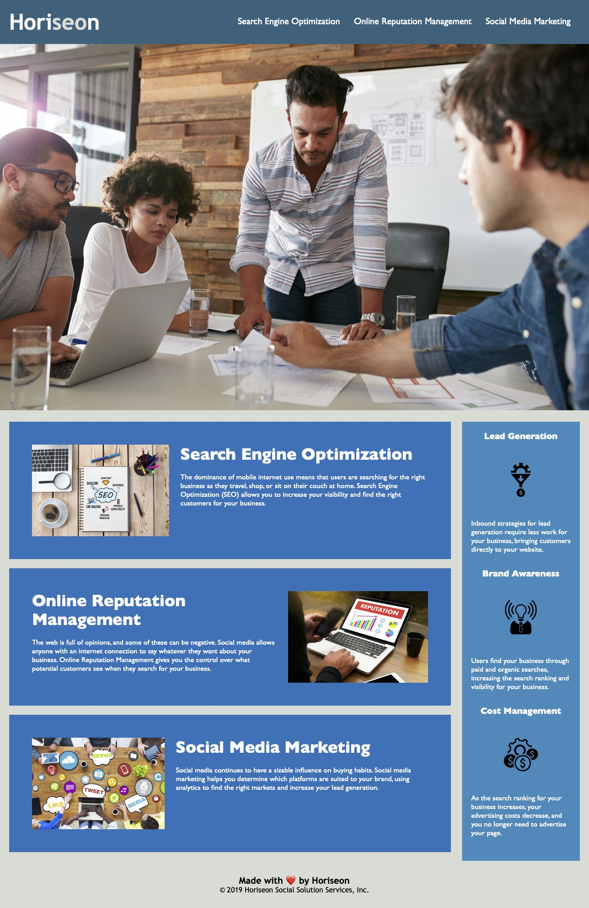

# Code-Refactor

## Description

Code refactor for Horiseon marketing agency to make website more accessible and improve code base for long term sustainability. 

### Completed work:

- Added descriptive title
- Added alt text to images and icons
- Repaired broken links 
- Removed generic div elements and used symantic selectors  
- Consolidated and organized CSS from 200 lines to 134 lines
- Commented on CSS  

## Table of Contents

- [Installation](#installation)
- [Usage](#usage)
- [Credits](#credits)
- [License](#license)

## Installation

- Website can be accessed [here](https://aimeedarling.github.io/horiseon-code-refactor/)

- Repository can be accessed [here](https://github.com/aimeedarling/horiseon-code-refactor)

## Usage

Screenshot of completed work.

## Credits
References used to complete refactor:
- [WSU HTML Cheat Sheet](https://websitesetup.org/wp-content/uploads/2019/10/WSU-HTML-Cheat-Sheet.pdf)
- [What is Semantic HTML](https://www.thoughtco.com/why-use-semantic-html-3468271)
- [Sementic HTML](https://www.internetingishard.com/html-and-css/semantic-html/)
- [WSU CSS Cheat Sheet](https://websitesetup.org/wp-content/uploads/2016/10/wsu-css-cheat-sheet.pdf)
- [Markdown Cheat Sheet](https://www.markdownguide.org/cheat-sheet/)

## License

Please refer to the LICENSE in the repo.

